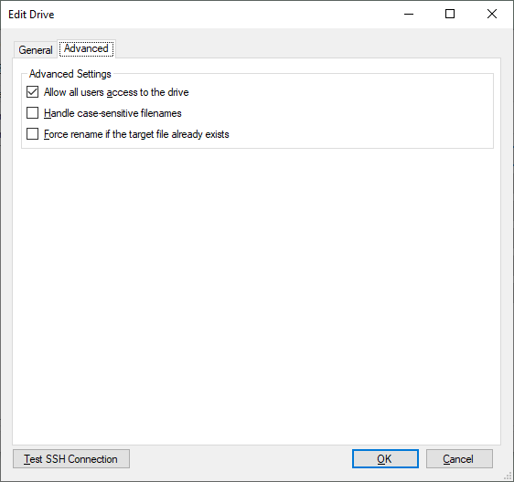
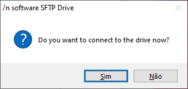

# SSH/SFTP Storage Drive on Windows 10

## This is a tutorial on how to configure a SFTP storage drive on Windows 10.

### Introduction
The most common way of implementing this kind of storage drive is well covered.
I.e.:
- [Mounting Linux FS on Windows 10 using SSHFS](https://medium.com/@danielmarinomirallestaset/mounting-linux-fs-in-windows-10-using-sshfs-e29c7ca81c87).

But that solution doesn't work quite well, at least it didn't for my Windows 10 computer, so I kept searching for a solution which turned out to be the NSoftware's _SFTP Drive_. It not only works better but it's also easier to install and use.

>_NSoftware SFTP Drive_ **is free to use only for Non-Commercial Use**.

### Step 1:
Download SFTP Drive ([link here](https://www.nsoftware.com/sftp/drive/)) at [NSoftware's official website](https://www.nsoftware.com/) and install it.

### Step 2:
>_For this step the shared storage server has ssh/sftp enabled with a known user and password or valid rsa public key._

After the installation, you have to add a new server, as shown in the image below:

Add the SSH/SFTP server identification and settings:

It is possible to make some minor advanced customizations:

It is possible to test the connection, which returns the following message:

> If it's the first time connecting to a given drive, there will be a prompt requesting a permission to add the server to the ssh known-hosts.

Once configured, you can connect to the drive straight after the settings edition:

_Et voilà_

Once configured you can connect to the drive from the _\n software_ management GUI. Just press **START**, seen in the first image, with the desired drive selected in the list.

>Notes:
>- The installation comes with [this manual](nsoftware.SFTPDrive.pdf) containing more in-depth instructions.
>- By the time when this article was finished, NSoftware's SFTP Drive supported only one remote drive connection at a time.
>- Once configured, the remote drive will be automatically available even right after the system's boot.

> This article was reviewed by Heitor Brandão at 2020-08-12