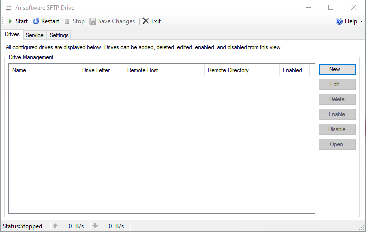
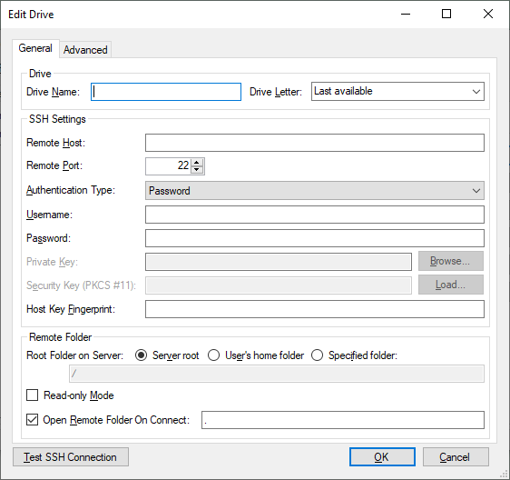

# Configuração de Armazenamento compartilhado por SSH/SFTP no Windows 10

## Esse é um tutorial de configuração de armazenamento compartilhado via SSH/SFTP no Windows.

### Introdução
A forma mais conhecida de configurar esse tipo de armazenamento está bem documentada, como no artigo abaixo:
- [Mounting Linux FS on Windows 10 using SSHFS](https://medium.com/@danielmarinomirallestaset/mounting-linux-fs-in-windows-10-using-sshfs-e29c7ca81c87).

Porém essa solução não funciona tão bem, ao menos não na minha máquina com Windows 10, então eu continuei procurando uma solução satisfatória. A solução encontrada, _SFTP Drive_, mantida pela NSoftware, não só funciona melhor como é mais facil de instalar e de usar.

>_NSoftware SFTP Drive_ **é gratuito exclusicamente para uso não-comercial**.

### Passo 1:
Download SFTP Drive ([link aqui](https://www.nsoftware.com/sftp/drive/)) no [site oficial da NSoftware](https://www.nsoftware.com/) e instale o _.exe_.

### Passo 2:
>_Para o próximo passo o servidor de armazenamento compartilhado precisa estar com o serviço de SSH/SFTP instalado e configurado com usuário e senha ou chave RSA pública válida._

Após a instalação, é preciso acrescentar o novo servidor, como ilustrado abaixo:

Acrescente a identificação do servidor SSH/SFTP e suas configurações:

É possível fazer pequenos ajustes avançados:

Também é possível testar a conexão durante a edição. O teste retorna a mensagem abaixo:

> Caso seja a primeira tentativa de conexão com determinado servidor, haverá um alerta pedindo permissão para acrescentar o servidor ao registro de servidores conhecidos _(SSH known-hosts)_.

Uma vez configurado, é possível conectar diretamente após a edição das configurações:

_Et voilà_

Após configurado é possível conectar com o drive de armazenamento a partir da interface do SFTP Drive. Apenas clique em **START**, conforme exibido na primeira imagem com o drive desejado selecionado na lista.

>Notas:
>- A instalação vem com [esse manual](nsoftware.SFTPDrive.pdf) contendo essas e outras informações mais detalhadas.
>- Até o momento em que esse artigo foi escrito, o SFTP Drive da NSoftware suporta a conexão com apenas um servidor de cada vez.
>- Uma vez configurado, o armazenamento remoto ficará disponível automaticamente, mesmo após a máquina reiniciar.

> Esse artigo foi revisado por Carolina Brandão em 2020-08-13.